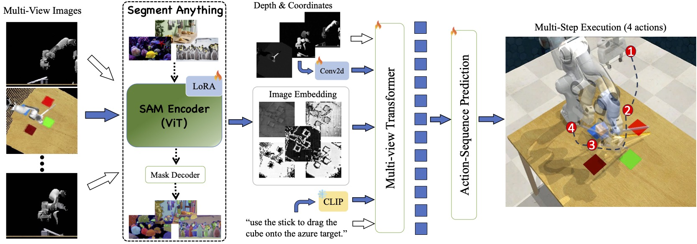

[***SAM-E: Leveraging Visual Foundation Model with Sequence Imitation for Embodied Manipulation***](https://sam-embodied.github.io/) <br/>
***ICML 2024***



```
@inproceedings{2024sam,
         author    = {Junjie Zhang, Chenjia Bai, Haoran He, Zhigang Wang, Bin Zhao, Xiu Li, Xuelong Li},
         title     = {SAM-E: Leveraging Visual Foundation Model with Sequence Imitation for Embodied Manipulation},
         booktitle = {International Conference on Machine Learning}
         year      = {2024},
}
```

This is the offical repository for [SAM-E](https://arxiv.org/pdf/2405.19586). Currently we provide the code for training. More updates are coming soon.


## Get Started

### Install
- **Step 1:** create a conda environment
```
conda create --name samE python=3.8
conda activate samE
```

- **Step 2:** Install PyTorch compatible with your CUDA version. 

- **Step 3:** Install PyTorch3D. 

PyTorch3D is essential for our SAM-E.

One recommended version that is compatible with the rest of the library can be installed as follows. Note that this might take some time. For more instructions visit [here](https://github.com/facebookresearch/pytorch3d/blob/main/INSTALL.md).
```
curl -LO https://github.com/NVIDIA/cub/archive/1.10.0.tar.gz
tar xzf 1.10.0.tar.gz
export CUB_HOME=$(pwd)/cub-1.10.0
pip install 'git+https://github.com/facebookresearch/pytorch3d.git@stable'
```

- **Step 4:** Install CoppeliaSim. PyRep requires version **4.1** of CoppeliaSim. Download and unzip CoppeliaSim: 
- [Ubuntu 16.04](https://downloads.coppeliarobotics.com/V4_1_0/CoppeliaSim_Player_V4_1_0_Ubuntu16_04.tar.xz)
- [Ubuntu 18.04](https://downloads.coppeliarobotics.com/V4_1_0/CoppeliaSim_Player_V4_1_0_Ubuntu18_04.tar.xz)
- [Ubuntu 20.04](https://downloads.coppeliarobotics.com/V4_1_0/CoppeliaSim_Player_V4_1_0_Ubuntu20_04.tar.xz)

Once you have downloaded CoppeliaSim, add the following to your *~/.bashrc* file. (__NOTE__: the 'EDIT ME' in the first line)

```
export COPPELIASIM_ROOT=<EDIT ME>/PATH/TO/COPPELIASIM/INSTALL/DIR
export LD_LIBRARY_PATH=$LD_LIBRARY_PATH:$COPPELIASIM_ROOT
export QT_QPA_PLATFORM_PLUGIN_PATH=$COPPELIASIM_ROOT
export DISPLAY=:1.0
```
Remember to source your .bashrc (`source ~/.bashrc`) or  .zshrc (`source ~/.zshrc`) after this.

- **Step 5:** Install samE and other submodules using the following command.
```
cd SAM-E/
pip install -e . 
pip install -e samE/libs/PyRep 
pip install -e samE/libs/RLBench 
pip install -e samE/libs/YARR 
pip install -e samE/libs/peract_colab
``` 

## Training
- **Step 1:** Download dataset

We use the same dataset as [RVT](https://github.com/nvlabs/rvt) for experiments in RLBench. Download the [dataset](https://drive.google.com/drive/folders/0B2LlLwoO3nfZfkFqMEhXWkxBdjJNNndGYl9uUDQwS1pfNkNHSzFDNGwzd1NnTmlpZXR1bVE?resourcekey=0-jRw5RaXEYRLe2W6aNrNFEQ) provided by [PerAct](https://github.com/peract/peract#download) to `SAM-E/samE/data/`. For training, you may only need to download the `/train/` and take it as `SAM-E/samE/data/train/`.

- **Step 2:** Start training

`python trainc_sam.py --exp_cfg_path configs/samE.yaml --mvt_cfg_path configs/mvt_samE.yaml --device 0,1,2,3`

Change the `device` flag depending on available gpus.

## Evaluation
update is comming soon

## Acknowledgement
We sincerely thank the authors of the following repositories for sharing their code.

- [RVT](https://github.com/nvlabs/rvt)
- [PerAct](https://github.com/peract/peract)
- [PerAct Colab](https://github.com/peract/peract_colab/tree/master)
- [PyRep](https://github.com/stepjam/PyRep)
- [RLBench](https://github.com/stepjam/RLBench/tree/master)
- [YARR](https://github.com/stepjam/YARR)
